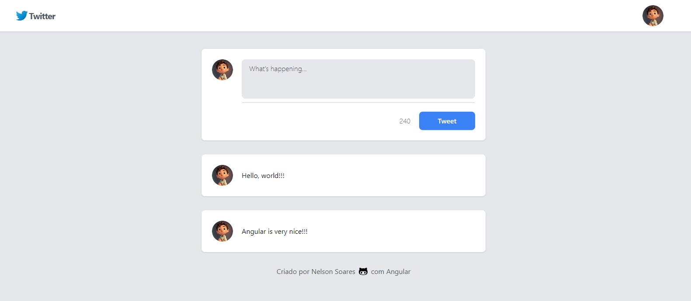

<h1 align="center">TwAula</h1>

	Clone pessoal do Twitter feito com Angular e TypeScript em um Aulão promovido pela 
	<a href="https://www.dio.me/">DIO</a> e ministrado pelo 
	<a href="https://github.com/felipeAguiarCode">Felipe Aguiar</a> através do seu canal no 
	<a href="https://www.youtube.com/@diomakethechange">YouTube</a> 

 

  

## 🚀 Tecnologias

Esse projeto foi desenvolvido com as seguintes tecnologias:

- HTML e CSS
- TypeScript
- Git e Github
- Angular
- Tailwind CSS

## 🗺️ Roadmap

O projeto é um estudo inicial do Framework angular, sendo abordado

- Componentização do front-end
- Como funciona os componentes
- Estilização de componentes com tailwind css
- Boas práticas de estrutura de projeto Angular
- Estrutura e pastas
- Criar componentes dinâmicos que recebem parâmetros
- Trabalhar com services e conectar components
- Diretivas Angulas para gerar páginas dinâmicas

Feito com ♥ by Nelson Soares
